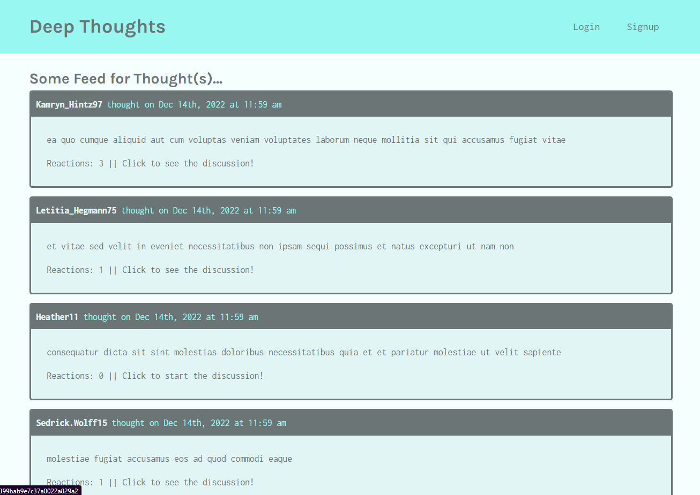

# Deep Thoughts

  
## Description

A social media application called "Deep Thoughts," where users can create an account, post their thoughts for others to see, and interact with other users through these thoughts.



## Table of Contents

- [Installation](#installation)
- [Usage](#usage)
- [License](#license)
- [Contributing](#contributing)
- [Tests](#tests)
- [Questions](#questions)

## Usage

Navigate to the [website](https://nifty-deep-thoughts.herokuapp.com/) to view other users' thoughts, create your own, or interact with existing thoughts by adding your reactions.

## Installation

This application requires NodeJS to run. Clone this repository to your local machine and run ```npm i``` to install required dependencies, then run ```npm start``` to initialize the server/database. The application may then be accessed in localhost.

## License
    
Licensed under the [MIT License](https://spdx.org/licenses/MIT.html)

## Contributing

No contributions to be accepted at this time.

## Tests

No further testing is planned for this project at this time.

## Questions

Have questions? Reach me at the following sources!

* GitHub: [realnifty](https://github.com/realnifty)
* E-mail: lovecore@pm.me